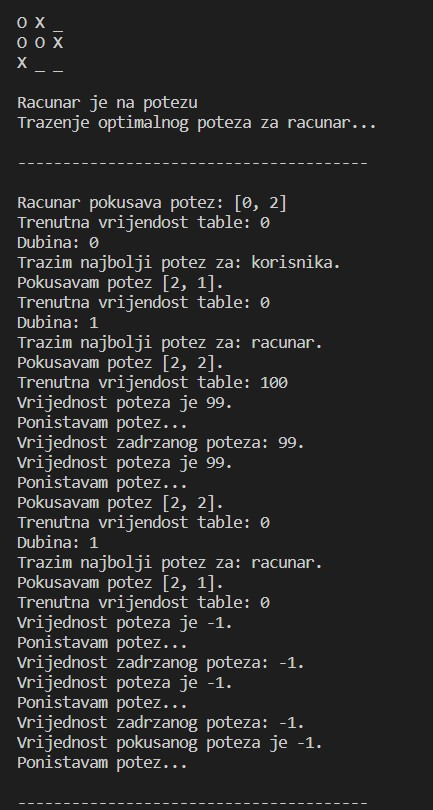

# OI-projekat

## Iks-oks korištenjem MinMax algoritma

Algoritam koristi backtracking, odnosno isprobava sve poteze dok ne nadje optimalan potez.
Pretpostavka je da i protivnik takodje igra optimalno, to jest bira poteze najbolje po njega.

###### BACKTRACKING:
Tabla u svakom trenutku ima sebi dodijeljenu vrijednost koja se racuna putem funkcije evaluateBoard (funkcijom evaluacije).
Tacnije, za svaki moguci potez koji algoritam 'napravi' tabli se dodjeljuje odredjena vrijednost, zatim se potez 'ponisti'.
Potezi se 'prave i ponistavaju' sve dok se tabla ne popuni ili se ne nadje potez koji tabli daje optimalnu vrijednost za trenutnog 
igraca, odnosno maksimalnu za maximizera, minimalnu za minimizera, i zatim se taj potez 'definitivno pravi'. 
Posto je broj mogucih poteza relativno mali, mozemo sebi priustiti da prije igranja svakog poteza 'probamo' svaki legalan potez
bez da se predugo ceka na dobijanje 'definitivnog poteza'. 

Funkcija minimax racuna optimalne poteze i za korisnika i za racunar. 

###### MINMAX ALGORITAM: 
Evaluira se vrijednost table, ukoliko partija nije gotova trazi se optimalan potez.
Recimo da prvi potez funkcija pravi za racunar, odnosno maximizera, potez koji ce se odabrati ce tabli da dodijeli maksimalnu vrijednost. Sada funkcija racuna optimalan potez za korisnika, odnosno minimizera, od svih mogucih poteza se bira potez koji ce da minimizuje vrijednost table, odnsno dodjeljuje joj najmanju vrijednost iz skupa svih trenutno mogucih vrijednosti. 
Sada ponovo za maksimizera bira potez koji ce maksimizovati vrijednost table i tako bira poteze dok ne isproba sve moguce kombinacije poteza.
Od svih mogucih poteza se bira onaj koji je optimalan.
Dakle, za maximizera se uvijek biraju potezi koji ce tabli dati najvecu vrijednost od svih mogucih vrijednosti, za minimizera
se biraju potezi koji ce da tabli dodijeli minimalnu vrijednost od svih mogucih vrijednosti (igra optimalno za oba igraca).

###### PONDERISANJE IZBORA:
Posto moze doci do situacije da vise poteza dovodi do pobjede maximizera ili minimizera da bi se osiguralo da se od svih
takvih poteza bira optimum racuna se za svaki potez dubina, odnosno broj koraka koji dovodi do pobjede ili nerijsenog rezultata ukoliko pobjeda onog ko je trenutno na potezu nije moguca. 
Zatim se taj broj koraka dodaje na vrijednost poteza u slucaju minimizera, odnosno potez se 'kaznjava', ili oduzima
od vrijednosti poteza u slucaju minimizera, istom logikom. Na taj nacin ce najmanje kaznjeni potezi imati najbolju
(najvecu za maximizera, najmanju za minimizera) vrijednost i oni ce se birati (jer su optimalni).

###### USLOV ZAVRSETKA:
Igra se zavrsava kada su ili sva polja popunjena ili kada neko pobijedi, odnsono spoji 3 ista znaka horizontalno,
vertikalno ili dijagonalno. Funkcija evaluacije u tom trenutku dobija vrijednost 'beskonacnosti' ukoliko su spojena 
tri O (maximizera) - O je pobijedio, ili 'negativne beskonacnosti' ukoliko su spojena tri X (minimizera) - X je pobijedio.
'Beskonacnosti' je dodijeljena vrijednost 100 po uzoru na algoritme za igranje šaha (chess engines).
U slucaju remija vrijednost funkcije evaluacije ostaje nula.

Najbolji potezi za racunar se racunaju u funkciji findBestMove koja vraca koordinate poteza sa maksimalnom
vrijednoscu funkcije evaluacije. 

###### PRIMER KORAKA:
Trenutni izgled table je  
    O X _ 
    O O X 
    X _ _ 
Racunar ce pokusavati poteze redom za svako moguce polje, prvo ce fiksirati svoj potez na koordinati **(0, 2)**.
Zatim će za korisnika probati polje **(2, 1)** i za sebe ostaviti polje **(2, 2)** što dovodi do remija, nakon toga ce
korisniku da da polje **(2, 2)** a za sebe ostaviti **(2, 1)** sto ponovo dovodi do remija. 
U narednom koraku se fiksira na narednu slobodno koordinatu **(2, 1)**, ponovo dodijeli prvo korisniku polje **(0, 2)** 
i ostavi za sebe **(2, 2)**. Ovo bi dovelo do pobjede racunara pa ova taktika ima vrijednost **99** jer dovodi do pobjede racunara
nakon jednog poteza koji igra korisnik. Potom korisniku dodijeli potez **(2, 2)** a za sebe ostavi potez **(2, 1)**. Ovo dovodi do remija nakon jednog poteza racunara pa ima vrijednost **-1**. Korisnik je minimizer pa od te dve bira **-1**. 
Na kraju racunar se fiksira na potez **(2, 2)**. Kako ovo dovodi do pobjede bez da korisnik igra ovaj potez ima vrijednost **100**, kako je ovo potez sa najvecom vrijednoscu a racunar je maximizer on se odlucuje za njega.
Citav proces se detaljno moze pogledati na slikama ispod:  

## Simplex Algoritam

###### ULAZNI PARAMETRI:
**N** - broj promenljivih 
**M** - broj ogranicenja 
Matrica *A* dimenzija **NxM** kroz koju su programu saljemo ogranicnja 
Vektor *B* duzine **M** kroz koji programu saljemo slobodne promenljive 
Vektor *C* duzine **N** kroz koji programu saljemo koeficijente u kriterijumu optimalnosti 
Tip kroz koji govorimo programu da li trazimo minimum ili maksimum 

###### TRANSFORMACIJA ULAZNIH PARAMETARA:

*Pod pretpostavkom da su nam sva ogranicenja tipa nejednakosti, transformisemo matricu **A** i vektor **C**:* 
Kreiramo jedinicnu matricu dimenzija **NxN** i spajamo je sa matricom **A**, na taj nacin smo svakom ogranicenju dodali dodatnu promenljivu i od nje napravili ogranicenje tipa jednakosti. Kako bismo ispostovali dimenzije, moramo vektor **C** produziti za **N** nula.

###### BIRANJE BAZNOG RESENJA:

Bazno resenje mora biti **M** dimenzije i inicijalno bazno resenje nam je prvih **M** promenljivih, a nakon njega redom proveravmo sve moguce **M**-torke promenljivih dok ne nadjemo odgovarajuce bazno resenje.   

*Provera baznog resenja:*<br\>
Iz matrice **A** uzimamo vrste koje odgovaraju indeksima iz baznog resenja koje proveravamo i smestamo ih u matricu **BR** koja je dimenzija **MxM**. 
Matricu **BR** pre svega transponujemo, a zatim ako je moguce i invertujemo. (U slucaju da invertovanje nije moguce, bazno resenje automatski nije dobro) 
Matricu **BR** zatim mnozimo sa vektorom **B**. Za dobijeni vektor proveravamo da li ima sve nenegativne vrednosti, ako ima, bazno resenje se uzima kao dobro.

##### BIRANJE BOLJEG RESENJA:

*Provera da li je trenutno resenje najbolje resenje:*  

Pre svega kreiramo nove matrice i vektore: 
**Cb** - vektor duzine **M** i predstavlja deo pocetnog vektora **C** za promenljive koje se nalaze u trenutnom resenju 
**Cn** - vektor duzine **N** i predstavlja ostatak vekotora **C** koji nije smesten u vektor **Cb** 
**Ab** - matrica dimenzija **MxM** i predstavlja deo pocetne matrice **A** za promenljive koje se nalaze u trenutnom resenju 
**An** - matrica dimenzija **NxM** i predstavlja ostatak matrice **A** koji nije smesten u matricu **Ab**  

Transponovani vektor **Cb** mnozimo sa invertovanom matricom **Ab**, a njihov proizvod mnozimo sa transponovanom matricom **An**. Od dobijenog vektora oduzimamo vektor **Cn**.
Ako dobijeni vektor ima sve negativne vrednosti i tip kriterijuma optimalnosti je minimum, trenutno resenje je najbolje i nema potrebe da nastavljamo postupak trazenja boljeg resenja. U slucaju da je kriterijum optimalnosti maksimum, dobijeni vektor mora da sadrzi sve pozitivne vrednosti.  

*Trazenje najpogodnije promenljive koja nije u trenutnom resenju:*  

Kreiramo matricu **Ab** i vektor **Cb** kao u prethodnom koraku. 
Uzimamo vrednost **Ci** koja predstavlja koeficijent iz kriterijuma optimalnosti za neku **i**-tu promenljivu koja nije u trenutnom resenju. 
Uzimamo vektor **Ai** koji predstavlja koeficijente iz ogranicenja za neku **i**-tu promenljivu koja nije u trenutnom resenju. 
Trazimo maksimalnu vrednost za tip kriterijuma optimalnosti minimum, odnosno minimalnu za tip kriterijuma optimalnosti maksimum, koju dobijamo tako sto pomnozimo transponovani vektor **Cb** sa inverznom matricom **Ab**, ciji prozivod zatim mnozimo sa vektorom **Ai** i od dobijene vrednosti oduzimamo **Ci**. 
Za onu promenljivu za koju pronadjemo minimum ili maksimum, ona postaje najpogodnija promenljiva koja nije u trenutnom resenju.  

*Trazenje najgore promenljive koja je u trenutnom resenju:*  

Kreiramo matricu **Ab** kao i u prethodnom koraku. 
Kreiramo vektor **Ank** koji predstavlja vrstu iz pocetne matrice **A** koja odgovara promenljivoj koju smo kao najpogodniju nasli u prethodnom koraku.
Racunamo vektor **AbB** koji se dobija kao proizvod invertovane matrice **Ab** i pocetnog vektora **B**. 
Racunamo vektor **y** koji se dobija kao proizvod invertovane matrice **Ab** i vektora **Ank**. 
Trazimo minimumalnu pozitivnu vrednost, za svaku promenljivu iz trenutnog resenja, koja se racuna kao **AbB/y**.
U slucaju da su sve vrenosti negativne nas optimum ce predstavljati beskonacnost, u suprotnom minimalna pozitivna vrednost je najgora promenljiva u trenutnom resenju.

*Najpogodniju promenljivu prebacujemo u trenutno resenje, a najgoru izbacujemo i vracamo se na korak gde proveravmo da li nam je novodobijeno resenje najbolje.*

