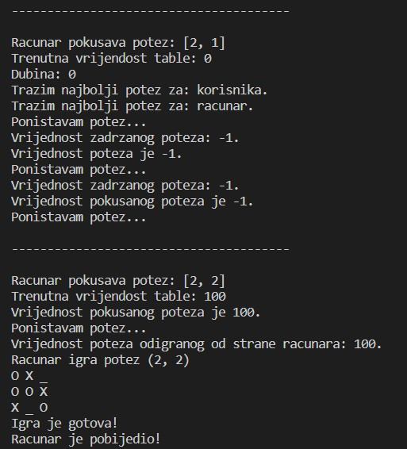

# OI-projekat

## Iks-oks korištenjem MinMax algoritma

Algoritam koristi backtracking, odnosno isprobava sve poteze dok ne nadje optimalan potez.
Pretpostavka je da i protivnik takodje igra optimalno, to jest bira poteze najbolje po njega.

###### BACKTRACKING:
Tabla u svakom trenutku ima sebi dodijeljenu vrijednost koja se racuna putem funkcije evaluateBoard (funkcijom evaluacije).
Tacnije, za svaki moguci potez koji algoritam 'napravi' tabli se dodjeljuje odredjena vrijednost, zatim se potez 'ponisti'.
Potezi se 'prave i ponistavaju' sve dok se ne nadje potez koji tabli daje optimalnu vrijednost za trenutnog 
igraca, odnosno maksimalnu za maximizera, minimalnu za minimizera, i zatim se taj potez 'definitivno pravi'. 
Posto je broj mogucih poteza relativno mali, mozemo sebi priustiti da prije igranja svakog poteza 'probamo' svaki legalan potez
bez da se predugo ceka na dobijanje 'definitivnog poteza'. 
Vrijednost table govori ko trenutno vodi. Tako ukoliko korisnik pobjedjuje tabla ce imati negativnu vrijednost, ukoliko dobija racunar, tabla ce imati neku pozitivnu vrijednost.

Funkcija minimax racuna optimalne poteze i za korisnika i za racunar. 

###### MINMAX ALGORITAM: 
Tabla prije svakog poteza ima neku evaluiranu vrijednost. 
Recimo da prvi potez funkcija pravi za racunar, odnosno maximizera, potez koji ce se odabrati ce tabli da dodijeli maksimalnu vrijednost. Sada funkcija racuna optimalan potez za korisnika, odnosno minimizera, od svih mogucih poteza se bira potez koji ce da minimizuje vrijednost table, odnsno dodjeljuje joj najmanju vrijednost iz skupa svih trenutno mogucih vrijednosti. 
Sada ponovo za maksimizera bira potez koji ce maksimizovati vrijednost table i tako bira poteze dok se igra ne zavrsi.
Dakle, za maximizera se uvijek biraju potezi koji ce tabli dati najvecu vrijednost od svih mogucih vrijednosti, za minimizera
se biraju potezi koji ce da tabli dodijeli minimalnu vrijednost od svih mogucih vrijednosti (igra optimalno za oba igraca).

###### PONDERISANJE IZBORA:
Posto moze doci do situacije da vise poteza dovodi do pobjede maximizera ili minimizera da bi se osiguralo da se od svih
takvih poteza bira optimum racuna se za svaki potez dubina, odnosno broj koraka koji dovodi do pobjede ili nerijsenog rezultata ukoliko pobjeda onog ko je trenutno na potezu nije moguca. 
Zatim se taj broj koraka dodaje na vrijednost poteza u slucaju minimizera, odnosno potez se 'kaznjava', ili oduzima
od vrijednosti poteza u slucaju minimizera, istom logikom. Na taj nacin ce najmanje kaznjeni potezi imati najbolju
(najvecu za maximizera, najmanju za minimizera) vrijednost i oni ce se birati (jer su optimalni).

###### USLOV ZAVRSETKA:
Igra se zavrsava kada su ili sva polja popunjena ili kada neko pobijedi, odnsono spoji 3 ista znaka horizontalno,
vertikalno ili dijagonalno. Funkcija evaluacije u tom trenutku dobija vrijednost 'beskonacnosti' ukoliko su spojena 
tri O (maximizera) - O je pobijedio, ili 'negativne beskonacnosti' ukoliko su spojena tri X (minimizera) - X je pobijedio.
'Beskonacnosti' je dodijeljena vrijednost 100 po uzoru na algoritme za igranje šaha (chess engines).
U slucaju remija vrijednost funkcije evaluacije ostaje nula.

Najbolji potezi za racunar se racunaju u funkciji findBestMove koja vraca koordinate poteza sa maksimalnom
vrijednoscu funkcije evaluacije. 

###### PRIMER KORAKA:
Trenutni izgled table je 
    O X _
    O O X
    X _ _
Racunar ce pokusavati poteze redom za svako moguce polje, prvo ce fiksirati svoj potez na koordinati **(0, 2)**.
Zatim će za korisnika probati polje **(2, 1)** i za sebe ostaviti polje **(2, 2)** što dovodi do remija, nakon toga ce
korisniku da da polje **(2, 2)** a za sebe ostaviti **(2, 1)** sto ponovo dovodi do remija. 
U narednom koraku se fiksira na narednu slobodno koordinatu **(2, 1)**, ponovo dodijeli prvo korisniku polje **(0, 2)** 
i ostavi za sebe **(2, 2)**. Ovo bi dovelo do pobjede racunara pa ova taktika ima vrijednost **99** jer dovodi do pobjede racunara
nakon jednog poteza koji igra korisnik. Potom korisniku dodijeli potez **(2, 2)** a za sebe ostavi potez **(2, 1)**. Ovo dovodi do remija nakon jednog poteza racunara pa ima vrijednost **-1**. Korisnik je minimizer pa od te dve bira **-1**. 
Na kraju racunar se fiksira na potez **(2, 2)**. Kako ovo dovodi do pobjede bez da korisnik igra ovaj potez ima vrijednost **100**, kako je ovo potez sa najvecom vrijednoscu a racunar je maximizer on se odlucuje za njega.
Citav proces se detaljno moze pogledati na slikama ispod.

